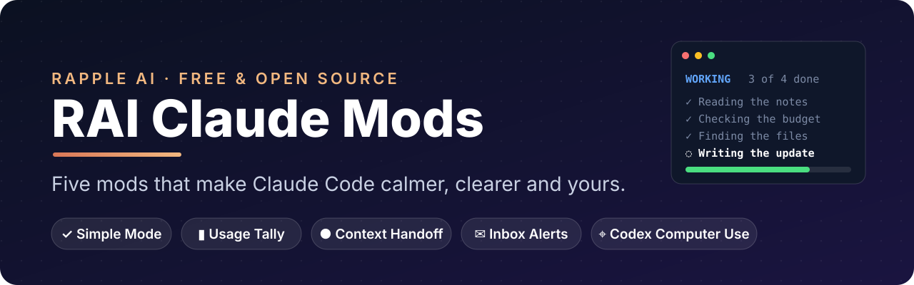

<p align="center"></p>

<p align="center">
  <b>Five free mods that make Claude Code calmer, clearer and yours.</b><br>
  See what Claude is doing in plain English, watch your plan limits, hand a full chat to a fresh one in one click, get pinged only for the emails that matter, and let Claude work your desktop apps through Codex.
</p>

<p align="center">
  <a href="#install">Install</a> ·
  <a href="demos/README.md">Five-minute tour</a> ·
  <a href="#the-mods">The mods</a> ·
  <a href="#what-each-mod-reaches">What each mod reaches</a> ·
  <a href="NOTICE.md">Credits</a>
</p>

<p align="center">
  
  
  
  
</p>

---

A **mod** is a Claude Code plugin made of function hooks. It runs inside Claude Code, so it can draw a pane beside the chat, a bar above the prompt or a status line, fold the chat's rows, add commands, and step into tool calls. These five are built for everyday use, tested, and free.

| | Mod | Command | What you get |
| --- | --- | --- | --- |
| ✓ | [**Simple Mode**](#simple-mode) | `/simple` | A plain-English checklist of what Claude is doing, one-line tool rows you can expand, and a two-line summary at the end of every reply |
| ▮ | [**Usage Tally**](#usage-tally) | `/tally` | Your 5-hour and weekly plan limits with reset countdowns in the status line, and a warning at 75% and 90% |
| ● | [**Context Handoff**](#context-handoff) | `/handoff` | A green / amber / red context bar with a Handoff button; the next chat picks up where this one stopped |
| ✉ | [**Inbox Alerts (Priority)**](#inbox-alerts-priority) | `/alerts` | Gmail, Slack and Calendar in a pane; pop-ups only for clients and words you choose |
| ⌖ | [**Codex Computer Use**](#codex-computer-use) | `/codex-cu` | Claude drives your desktop apps through the Codex app's engine, reading exact values, with your approval per app |

## Install

Needs **Claude Code 2.1.287 or newer** in a terminal, or 2.1.286+ in the desktop app's Code tab (check with `claude --version`, or `/status` in the app).

**1. Add this marketplace** (once). In a Claude Code chat:

```text
/plugin marketplace add Ankitrai97/rai-claude-mods
```

**2. Install the mods you want:**

```text
/plugin install simple-mode@rai-claude-mods
/plugin install usage-tally@rai-claude-mods
/plugin install context-handoff@rai-claude-mods
/plugin install inbox-alerts-priority@rai-claude-mods
/plugin install codex-computer-use@rai-claude-mods
```

**3. Load them:** type `/reload-plugins`, then `/plugin`. The line under the tabs lists the active mods, for example `5 mods active · simple-mode, usage-tally, …`.

Prefer your shell? Install them all at once:

```bash
claude plugin marketplace add Ankitrai97/rai-claude-mods
for m in simple-mode usage-tally context-handoff inbox-alerts-priority codex-computer-use; do claude plugin install "$m@rai-claude-mods"; done
```

```powershell
claude plugin marketplace add Ankitrai97/rai-claude-mods
'simple-mode','usage-tally','context-handoff','inbox-alerts-priority','codex-computer-use' | % { claude plugin install "$_@rai-claude-mods" }
```

### Or run them from a clone (to tinker)

```bash
git clone https://github.com/Ankitrai97/rai-claude-mods.git
claude plugin marketplace add ./rai-claude-mods      # installs read straight from your folder
claude plugin install simple-mode@rai-claude-mods
```

Edit a file in the folder, then `/reload-plugins` in your chat: no reinstall needed. To try one for a single session without installing: `claude --plugin-dir ./rai-claude-mods/plugins/simple-mode`.

Then take the [five-minute tour](demos/README.md): it has sample notes and a messy spreadsheet to try every mod on.

## The mods

### Simple Mode

**The short version of what Claude is doing.** Turn it on with `/simple` and:

```text
┌ Simple Mode ─────────────────────────────┐
│ WORKING   3 of 4 steps done              │
│                                          │
│ ✓  Reading the monday kickoff notes      │
│ ✓  Reading the wednesday check in notes  │
│ ✓  Reading the friday wrap notes         │
│ ◌  Writing the weekly update notes       │
└──────────────────────────────────────────┘
```

- every tool call in the chat folds to one line, `✓ Reading the budget notes   ▸ detail`; click it for the full row
- every reply ends with **Done:** and **Result:**, one plain sentence each
- `/simple` again brings the normal view back; the setting carries across chats

Perfect for client demos, training sessions, or just a calmer screen. No model calls, no network. [Read more →](plugins/simple-mode)

### Usage Tally

**Your plan limits, without leaving Claude Code.** The status line always shows

```text
Session 28% · resets 4h 30m · Week 31%
```

`/tally` opens a pane with a coloured bar per limit (green under 75%, amber, red from 90%), each reset countdown, and this chat's cost and context fill. A toast warns you at 75% and again at 90%, once per window. The numbers are the ones Claude's own replies report, and they count claude.ai and Claude Code together. [Read more →](plugins/usage-tally)

### Context Handoff

**Never lose a long chat to a full context window.** A bar above the prompt:

```text
 ● 72% context · getting full  144k / 200k  ▁▂▃▅▆▇   [ H  Handoff ]
```

Click **H Handoff** (or `/handoff`): Claude writes a plain-English note (Goal, What's done, Decisions, Key files, Next steps) to `.claude/handoff.md`. Open a new chat in the same project and it loads automatically, once. Ask *"what were we working on?"* and Claude knows. [Read more →](plugins/context-handoff)

### Inbox Alerts (Priority)

**Your inbox, minus the noise.** Gmail, Slack and Calendar in one pane (`/alerts`). Only messages from your clients, or with words like *quote*, *invoice*, *booking* or *urgent*, pop up; the rest wait quietly. `/alerts triage` asks Claude to rank what's unread and draft replies; nothing is ever sent for you. Uses your own claude.ai Gmail, Slack and Google Calendar connectors. [Read more →](plugins/inbox-alerts-priority)

### Codex Computer Use

**Claude thinks, Codex clicks.** Claude Code's computer use, routed through the engine inside OpenAI's Codex app, which reads apps through the accessibility layer: exact cell values and field contents, not guesses from a screenshot. Ask *"clean up messy-leads.xlsx on my Desktop"*, approve Excel once, and watch it remove duplicates, fix names and phones, sort and highlight. Works on **Windows** (Codex app) and **macOS** (ChatGPT app); on Windows it takes over the mouse and keyboard while it acts. [Read more →](plugins/codex-computer-use)

## What each mod reaches

A mod runs with your permissions, so here is everything each one touches. You can check any of it yourself: `claude plugin validate plugins/<mod>` lists every event a mod hooks and every call it makes.

| Mod | Network | Runs processes | Files | Calls a model | Sends data anywhere |
| --- | --- | --- | --- | --- | --- |
| simple-mode | No | No | `~/.claude/simple-mode.json` (on/off) | No | No |
| usage-tally | No | No | No | No | No |
| context-handoff | No | One rename (`Move-Item` / `mv`) of the note | `.claude/handoff.md` and `handoff-used.md` in your project | No; the Handoff button sends Claude one prompt in your chat | No |
| inbox-alerts-priority | Through your claude.ai connectors only | No | Reads its own `clients.txt` and `priority-words.txt` | No; `/alerts triage` sends Claude one prompt in your chat | Only to your connectors (Gmail, Slack, Calendar) |
| codex-computer-use | `127.0.0.1` only (its own bridge) | Starts its bridge with Node | Reads `~/.codex/config.toml`; writes `~/.claude/codex-cu/` | No | Window contents to Codex's local engine; what Claude reads goes to Claude |

There is no Rapple AI server. Nothing here phones home. See [SECURITY.md](SECURITY.md).

## Check them yourself

Every mod ships with tests (35 in all) that run against Claude Code's own engine:

```bash
claude plugin validate plugins/simple-mode
claude plugin test plugins/simple-mode
```

## Troubleshooting

- **A mod doesn't show up.** Run `/plugin`: the dim line under the tabs names the active mods. Missing? Check your version (2.1.287+, desktop 2.1.286+), then `/reload-plugins`. Mods don't load under `--safe-mode`, `--bare` or `"disableAllHooks": true`.
- **The Simple Mode pane doesn't open by itself.** In a narrow terminal there's no room for a side pane; type `/simple` and it opens.
- **Usage Tally says "No limit reading yet".** The figures arrive with Claude's next reply, and only on a Claude subscription (an API key has cost but no plan limits).
- **Two bars above the prompt.** Only one band fits there; Context Handoff uses it. Another mod that draws a band competes for the same spot.
- **Codex Computer Use can't start the bridge.** Make sure the Codex app (Windows) or ChatGPT app (macOS) is installed with computer use set up, then `/codex-cu status`.

## Credits

Four of these started from great open-source work, and each keeps its original license and a `CHANGES.md`:
**Simple Mode** and **Inbox Alerts** from [OneWave AI's claude-code-mods](https://github.com/OneWave-AI/claude-code-mods) (MIT), **Context Handoff** from Anthropic's [token-weather](https://github.com/anthropics/claude-code-playground/tree/main/claude-code/mods/token-weather) sample (Apache-2.0), and **Codex Computer Use** from Prompt Advisers' Computer Use mod (MIT). **Usage Tally** is new. Full details in [NOTICE.md](NOTICE.md).

This is an independent community project, not made or endorsed by Anthropic or OpenAI.

## License

MIT for the repository and Rapple AI's own work ([LICENSE](LICENSE)); each adapted mod keeps its original license in its folder (context-handoff is Apache-2.0).

---

<p align="center">Built by <a href="https://rappleai.com">Rapple AI</a> · AI automation for service businesses · If these save you time, a ⭐ helps others find them.</p>
